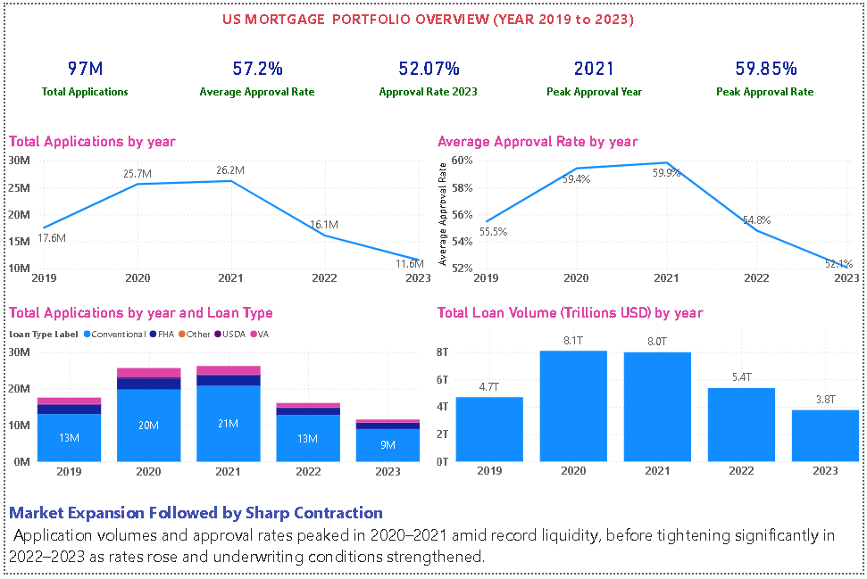
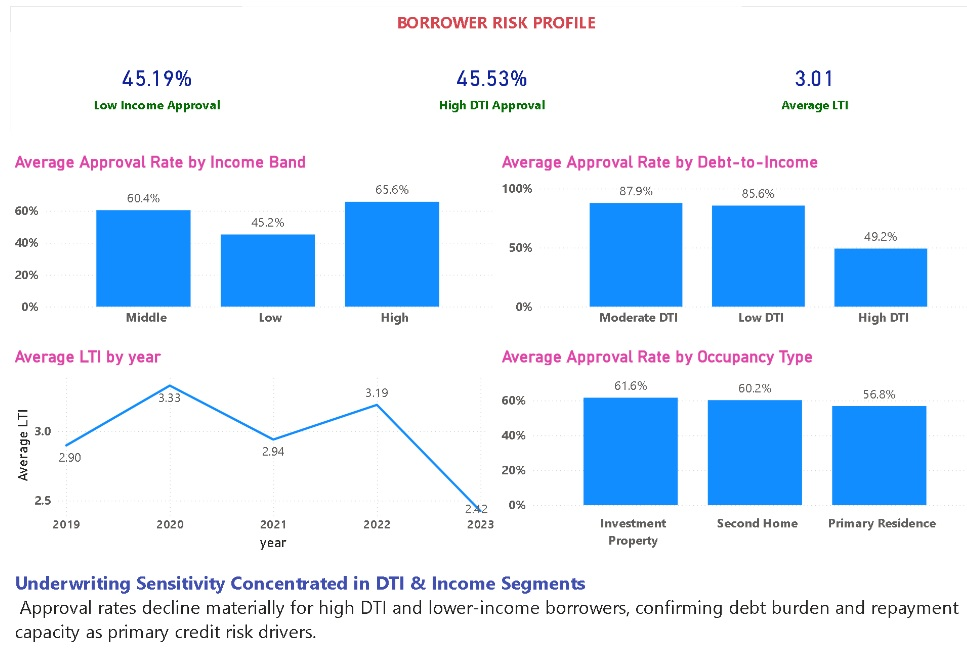
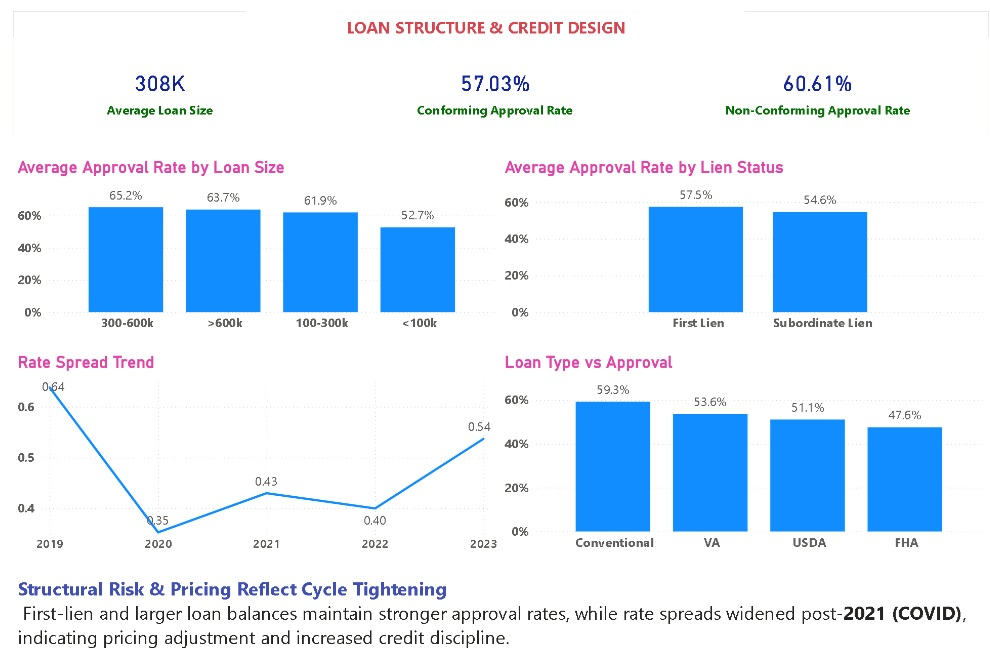
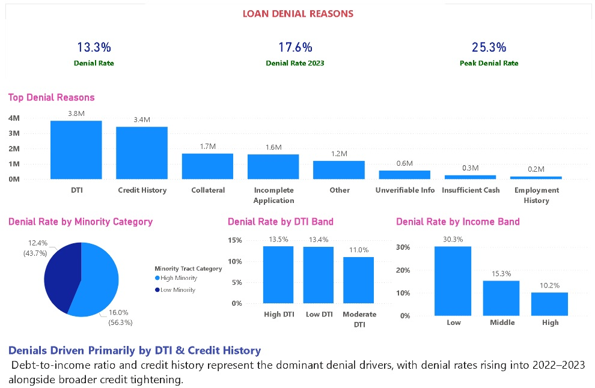
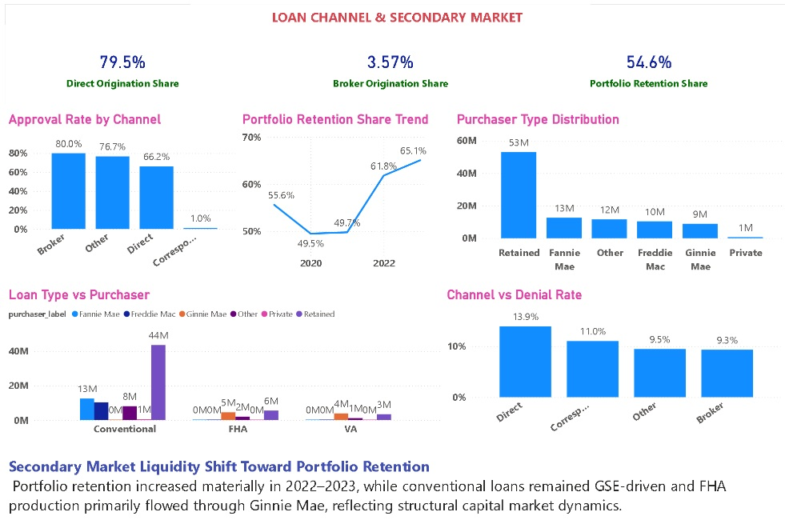
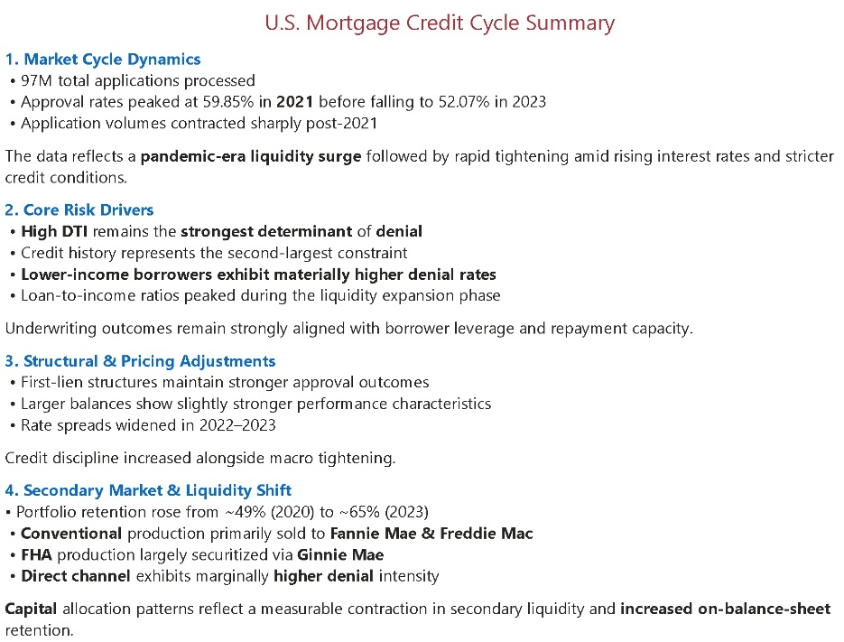
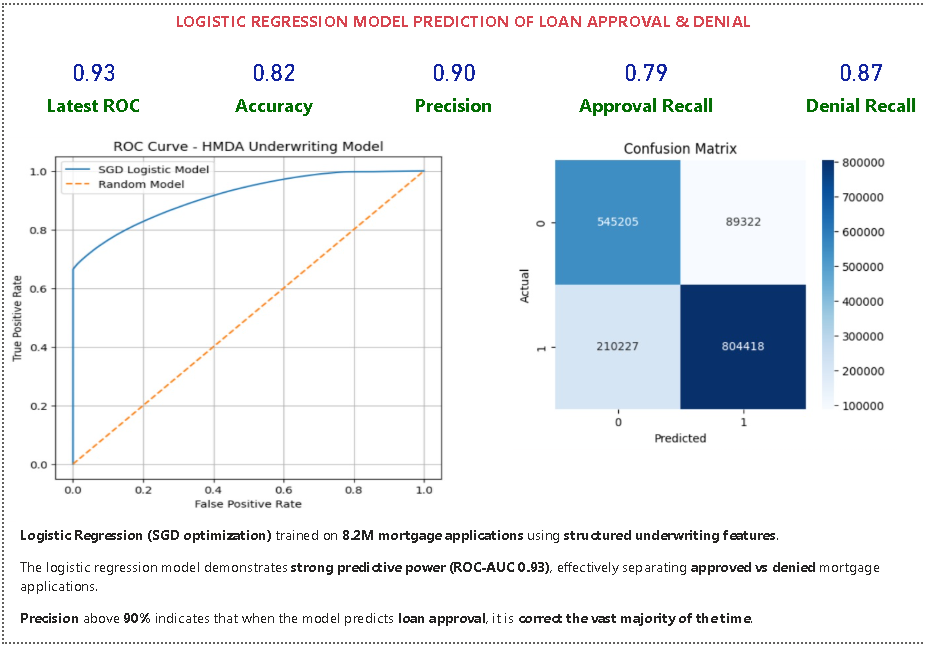
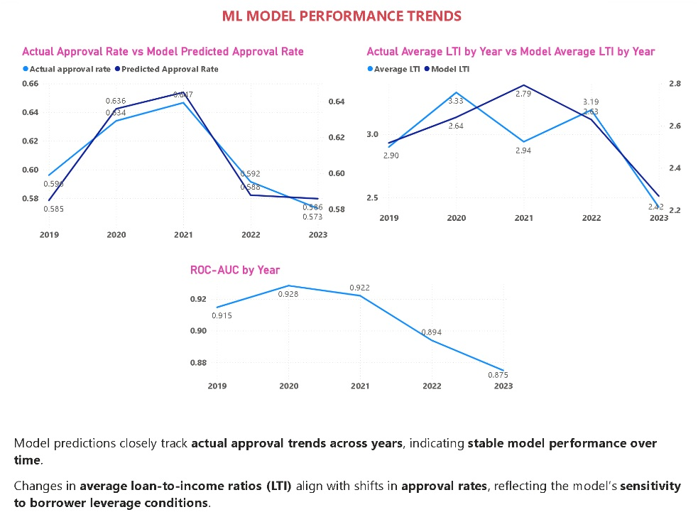
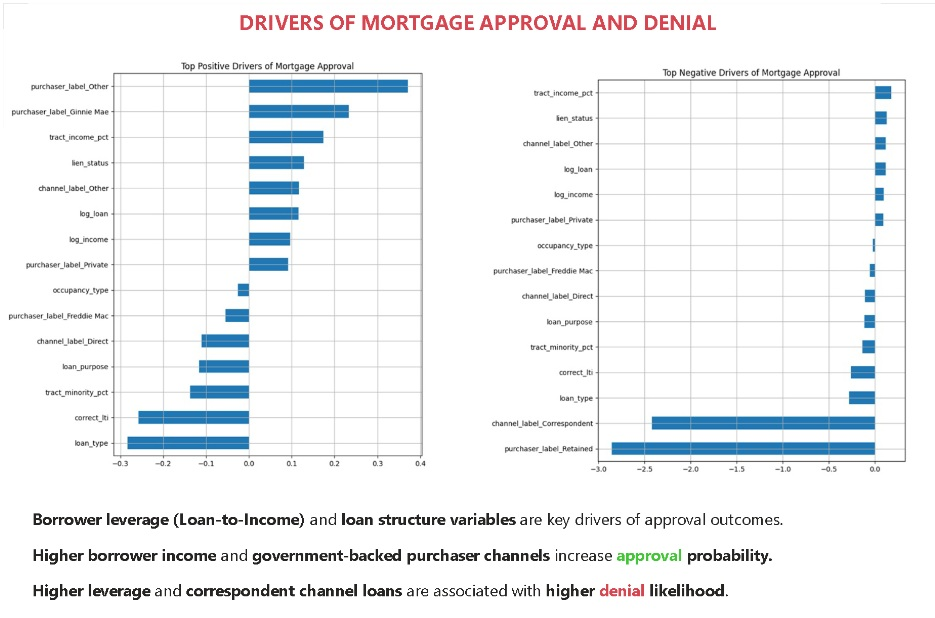
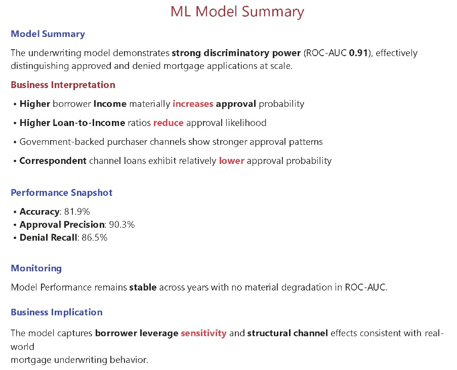

# US HMDA Mortgage Dataset Analysis

## Case Study Question

Does borrower income, leverage, loan structure, and channel information explain mortgage approval outcomes in the HMDA dataset?

---

## Project Overview

This project analyzes five years (2019–2023) of U.S. mortgage loan-level data from the Home Mortgage Disclosure Act (HMDA) dataset. The objective is to examine underwriting patterns, approval trends, denial behavior, and lending structure across changing economic conditions.

The workflow was implemented entirely within AWS for data processing, with Power BI used for executive-level visualization and machine learning for predictive underwriting analysis.

---

## Dashboard Preview

---

## Technology Stack

- AWS S3 (Data Lake)
- Amazon Athena (SQL & Parquet optimization)
- Python (pandas, scikit-learn)
- Amazon SageMaker (Model training environment)
- Power BI (Visualization & Reporting)

---

## Data Architecture

HMDA Pipe Files (S3 raw/) ➝ Athena External Table (hmda_raw) ➝ Partitioned Parquet Table (hmda_parquet) ➝ Feature Engineering View (hmda_underwriting_features) ➝ Power BI Dashboard

---

## Data Pipeline

### 1. Raw Data Layer
- Uploaded HMDA pipe-delimited Loan Application Register (LAR) files (2019–2023) to Amazon S3
- Created partitioned external table in Athena

### 2. Parquet Optimization
- Converted raw data into partitioned Parquet format using CTAS
- Reduced scan cost and improved query performance

### 3. Feature Engineering Layer
Created structured underwriting features:

- Loan-to-income ratio (LTI)
- Income bands
- Debt-to-income (DTI) segmentation
- Loan size buckets
- Approval flag
- Channel and purchaser labels
- Minority tract indicators

### 4. Validation & QA
- Row count reconciliation
- Approval rate validation
- Loan type distribution checks
- Data consistency verification

---

## Dataset Scale

- ~30GB raw mortgage dataset
- ~5 years of loan-level data
- Partitioned by year for efficient querying

---

# 📊 Business & Credit Analysis

## 1. Mortgage Market Overview

- 97M applications analyzed
- Approval rates peaked in 2021 (59.85%)
- Sharp contraction observed post-2021 due to rate tightening

---

## 2. Borrower Risk Profile

**Key Insights:**
- High DTI borrowers show significantly lower approval rates
- Lower-income applicants face higher denial rates
- LTI peaked during liquidity expansion phase

---

## 3. Loan Structure & Credit Design

**Key Insights:**
- First-lien loans have stronger approval rates
- Larger loan sizes perform better
- Rate spreads widened post-2021 → tighter credit pricing

---

## 4. Loan Denial Analysis

**Key Insights:**
- DTI and credit history are primary denial drivers
- Lower income segments show highest denial rates
- Denials increased significantly during tightening cycle

---

## 5. Loan Channel & Secondary Market

**Key Insights:**
- Direct channel dominates origination
- Portfolio retention increased sharply (2022–2023)
- GSEs (Fannie Mae, Freddie Mac) dominate conventional loans

---

## 6. Credit Cycle Summary

**Summary:**
- Pandemic-driven liquidity expansion (2020–2021)
- Followed by aggressive tightening (2022–2023)
- Credit discipline increased across underwriting layers

---

# 🤖 Machine Learning Model

## Model Overview

A scalable logistic regression model was built to classify mortgage approvals using **8.2M loan records**.

- Binary classification (Approved vs Denied)
- SGDClassifier (log-loss)
- Standardized features
- Parallel training for scalability
- Converged in 7 epochs

---

## Model Dashboard

---

## Model Performance Trends

- ROC-AUC remains stable across years (~0.87–0.93)
- Model tracks real-world approval trends effectively
- LTI trends align with approval rate shifts

---

## Drivers of Approval & Denial

**Key Drivers:**
- Income → Positive driver
- Loan-to-income (LTI) → Negative driver
- Government-backed channels → Higher approval probability
- Correspondent channel → Higher denial risk

---

## Model Summary

### Performance Metrics

- ROC-AUC: 0.91
- Accuracy: 81.9%
- Approval Precision: 90.3%
- Denial Recall: 86.5%

---

## Business Interpretation

- Borrower leverage is the strongest determinant of credit decisions
- Income stability directly improves approval probability
- Structural factors (channel, purchaser) influence underwriting outcomes
- Model aligns closely with real-world credit risk behavior

---

## Final Takeaway

This project demonstrates how large-scale mortgage data can be transformed into:

- Structured analytical pipelines (AWS + Athena)
- Executive-level dashboards (Power BI)
- Interpretable ML models for underwriting

It reflects real-world credit risk dynamics across macroeconomic cycles and underwriting strategies.
